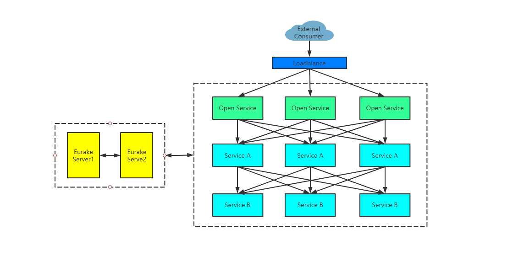
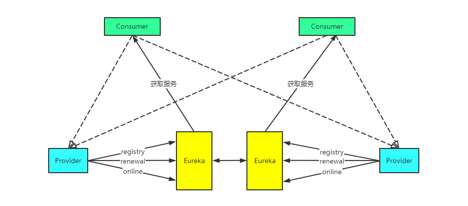
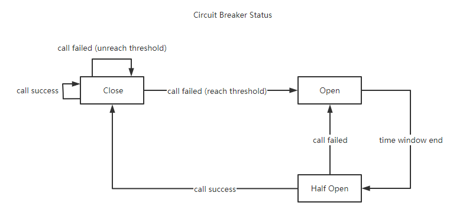
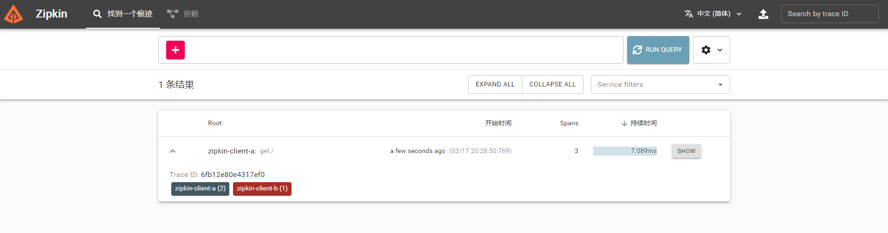
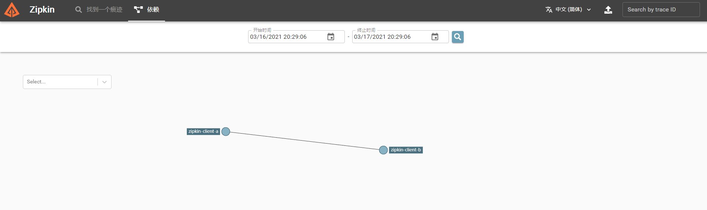
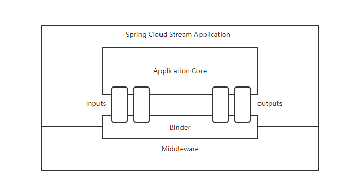
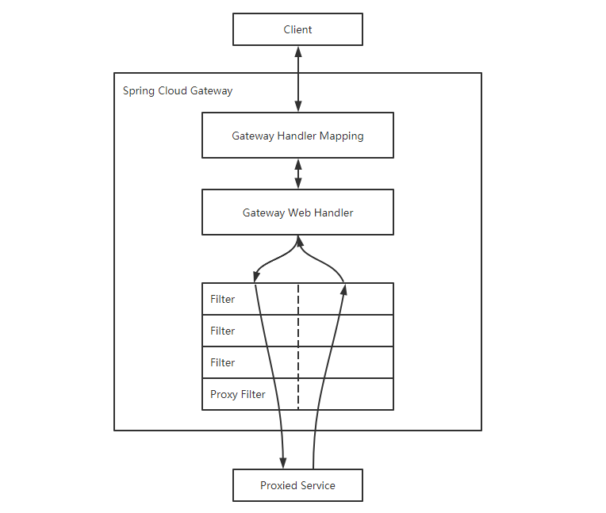

# Spring Cloud Example

## 背景

在微服务场景下，单体应用被拆分成多个微服务应用来获取更高的开发运维体验，在微服务架构的种种优势下，也有着许多伴随架构而产生的问题需要解决，如服务治理、进程间通信、服务容错保护、事件驱动、链路追踪等等。如何解决这些在特定架构下所必然出现的问题，于是便促生了现行的各种微服务框架及模块，如`Netflix`家族、`SpringCloud`家族、`SpringCloudAlibaba`家族等。

本项目使用`SpringCloud`家族对微服务场景下的各种问题做简单的示例解决方案，各个服务间架构如下图所示。



下文对各个模块的使用过程做详细说明。

## 环境

- `java 8`
- `spring boot 2.3.7.RELEASE`
- `spring cloud Hoxton.SR9`

## 依赖

- `spring-cloud-starter-netflix-eureka-server`
- `spring-cloud-starter-netflix-eureka-client`
- `spring-cloud-starter-openfeign`
- `spring-cloud-starter-loadbalancer`
- `resilience4j-spring-cloud2`
- `spring-cloud-starter-sleuth`
- `spring-cloud-sleuth-zipkin`
- `spring-cloud-stream`
- `spring-cloud-stream-binder-rabbit`
- `spring-cloud-config-server`
- `spring-cloud-starter-config`
- `spring-cloud-starter-gateway`

## 模块

### 服务发现与注册（Eureka）

·pringCloud使用Eureka作为注册中心来提供服务注册与服务发现功能，Eureka的设计实现了CAP原则中的AP部分，保证了可用性。集群部署的Eureka服务架构如下图所示。



下面介绍Server端与Client端的具体实现。

#### Server端

引入依赖

```xml
<dependency>
    <groupId>org.springframework.cloud</groupId>
    <artifactId>spring-cloud-starter-netflix-eureka-client</artifactId>
</dependency>
```

添加注解

```java

@EnableEurekaServer
@SpringBootApplication
public class EurekaServerApplication {

    public static void main(String[] args) {
        SpringApplication.run(EurekaServerApplication.class, args);
    }

}
```

单机模式下，关闭自注册和相关日志，配置文件为

```properties
spring.application.name=eureka-server
server.port=8761

eureka.client.register-with-eureka=false
eureka.client.fetch-registry=false

logging.level.com.netflix.eureka=OFF
logging.level.com.netflix.discovery=OFF
```

#### Client端

引入依赖

```xml
<dependency>
    <groupId>org.springframework.boot</groupId>
    <artifactId>spring-boot-starter-web</artifactId>
</dependency>
<dependency>
	<groupId>org.springframework.cloud</groupId>
	<artifactId>spring-cloud-starter-netflix-eureka-client</artifactId>
</dependency>
```

Spring使用`DiscoveryClient`抽象来和注册中心进行通信，`@EnableDiscoveryClient`注解会激活`Eureka`的相关实现，对于其他类型的注册中心也有自己的相关实现。

```java
@RestController
public class ServiceInstanceRestController {
    @Autowired
    private DiscoveryClient discoveryClient;

    @RequestMapping("/service-instances/{applicationName}")
    public List<ServiceInstance> serviceInstancesByApplicationName(@PathVariable String applicationName) {
        return this.discoveryClient.getInstances(applicationName);
    }
}
```

在配置文件中指定`Eureka`的地址

```properties
spring.application.name=eureka-client
server.port=8000
eureka.client.serviceUrl.defaultZone=http://localhost:8761/eureka
```

访问http://localhost:8761/ 便可以看到`eureka-client`应用已经注册成功。

访问http://localhost:8000/service-instances/eureka-client 可以看到从`Eureka Server`查询到的服务信息。

### 进程间通信（Feign）

`OpenFeign`提供了声明式的`web`服务调用（即声明式的`web`服务客户端），使得开发可以通过接口的方式轻松的调用第三方服务，并提供如服务容错保护（`Hystrix`），超时保护等功能。

使用时`Provider`和`Consumer`服务均需向注册中心中进行注册，`Consumer`的`Feign client`通过`Provider`的服务名向注册中心检索获并取其真实地址，然后完成通信，下面详细介绍二者的使用实现。

#### Provider方

`Provider`方为普通的`web`服务客户端，通过`@RestController`注解提供`REST`端点服务。如

```java
@RestController
public class OpenFeignProviderController {

    @GetMapping("")
    public String sayHi() {
        return "hi, this is from open feign provider";
    }

    @GetMapping("fail")
    public String sayHiWithFail() {
        throw new RuntimeException("hi, this is from open feign provider with fail");
    }

    @GetMapping("sleep")
    public String sayHiWithSleep() throws InterruptedException {
        TimeUnit.SECONDS.sleep(10);
        return "hi, this is from open feign provider with sleep 10s";
    }
}
```

#### Consumer方

添加依赖

```xml
<dependency>
    <groupId>org.springframework.cloud</groupId>
    <artifactId>spring-cloud-starter-openfeign</artifactId>
</dependency>
```

声明`web`服务客户端，并可以在其中指定对应的断路器实现

```java
@FeignClient(value = "${openfeign.provider.name}", fallback = OpenFeignProviderFallback.class)
public interface IOpenFeignProvider {
    @GetMapping("")
    String sayHi();

    @GetMapping("fail")
    String sayHiWithFail();

    @GetMapping("sleep")
    String sayHiWithSleep();
}
```
断路器具体实现

```java
@Component
public class OpenFeignProviderFallback implements IOpenFeignProvider {
    @Override
    public String sayHi() {
        return "hi, this is from open feign customer call back, sayHi";
    }

    @Override
    public String sayHiWithFail() {
        return "hi, this is from open feign customer call back, sayHiWithFail";
    }

    @Override
    public String sayHiWithSleep() {
        return "hi, this is from open feign customer call back, sayHiWithSleep";
    }
}
```

`Feign client`的支持超时时间的配置，这里超时时间分为`connect-timeout`和`read-timeout`两种，单位为毫秒。

-   `connect-timeout`对应客户端与目标服务建立连接的时间
-   `read-timeout`对应建立连接后，等待服务方返回响应的时间

二者使用时可以配置文件中指定，可以指定默认的超时时间（`default`），也可以通过`FeignClient`名称来特别指定某个服务的超时时间。

默认状态下容错保护（`Hystrix`）默认为关闭状态，可以在配置文件中开启，如下。

```properties
spring.application.name=openfeign-consumer
server.port=8020

eureka.client.serviceUrl.defaultZone=http://localhost:8761/eureka

feign.hystrix.enabled=true
feign.client.config.default.connect-timeout=5000
feign.client.config.default.read-timeout=5000

# 取消默认的ribbon实现
spring.cloud.loadbalancer.ribbon.enabled=false

openfeign.provider.name=openfeign-provider
```

启动后，分布请求以下地址，可以观测到对应现象：

- http://localhost:8020  正常返回
- http://localhost:8020/fail 服务提供方出现异常，触发容错保护
- http://localhost:8020/sleep 服务提供方请求超时，触发容错保护

### 客户端负载均衡（Spring Cloud Loadbalancer）

在`SpringCloud`家族中，默认的负载均衡实现为`Rbiion`，但在不幸的是该项目已停止维护，`Spring`官方推荐`Spring Cloud Loadbalancer`来替换它。

在项目中，可通过在配置关闭`Ribbon`来启用`Spring Cloud Loadbalancer`

添加依赖

```xml
<dependency>
    <groupId>org.springframework.cloud</groupId>
    <artifactId>spring-cloud-starter-loadbalancer</artifactId>
</dependency>
```

修改配置

```properties
# 取消默认的ribbon实现
spring.cloud.loadbalancer.ribbon.enabled=false
```

### 服务容错保护 （Resilience4j）

服务容错保护，目前在`OpenFeign`中默认集成了`Hystrix`的实现，但同样的该项目也停止了维护，`Spring`官方推荐使用`Resilience4j`来替换它。

`Resilience4j`是一个轻量、易用、可组装的高可用框架，支持***熔断***、***高频控制***、***隔离***、***限流***、***限时***、***重试***等多种高可用机制。 目前实现上述服务容错的方案大致可分为以下五种：

1.  超时：给每个请求配置一个超时时间，如果超过配置时间，则释放线程资源
2.  限流：为服务设置最大并发数，放置线程生成过多而导致资源耗尽
3.  仓壁模式：每个服务使用独立的线程池，相互之间隔离，互不影响
4.  断路器模式：当一个服务触发断路条件时，开启断路器
5.  重试：进行多次尝试来容错

在断路器模式中，设计断路器状态的变化，断路器会在关闭、开启、半开三个模式之间转换，具体如下图：



下文详细介绍每种模式的具体配置以及使用方式。

#### 依赖

```xml
<dependency>
    <groupId>io.github.resilience4j</groupId>
    <artifactId>resilience4j-spring-cloud2</artifactId>
    <version>1.7.0</version>
</dependency>
```

#### 限流模式

使用`@RateLimiter`注解，` Resilicence44j `的限流实现有

-    `io.github.resilience4j.ratelimiter.internal.AtomicRateLimiter` 默认，基于令牌桶算法 
-   `io.github.resilience4j.ratelimiter.internal.SemaphoreBasedRateLimiter` 基于`Semaphore`类 

```java
@RateLimiter(name = "testRateLimiter", fallbackMethod = "fallbackMethod")
@GetMapping("testRateLimiter")
public String testRateLimiter(){
    return "ok";
}
```

相关配置

```properties
# 在刷新周期内，请求的最大频次
resilience4j.ratelimiter.instances.testRateLimiter.limit-for-period=1
# 刷新周期时长
resilience4j.ratelimiter.instances.testRateLimiter.limit-refresh-period=1s
# 线程等待许可的时间，0表示线程不等待则直接抛异常
resilience4j.ratelimiter.instances.testRateLimiter.timeout-duration=0
```

#### 仓壁模式

` Resilicence44j `的仓壁模式的实现有

-   ` Semaphore`方式：默认，每个请求去获取信号量，如果没有获取到，则拒绝请求
-   `ThreadPool`方式：每个请求去获取线程，如果没有获取到，则进入等待队列，如果队列已满，则执行拒绝策略

从性能角度来看，基于`Semaphore`要优于基于`ThreadPool`要好，在基于`ThreadPool`时，可能会导致过多的小型的隔离线程池，会导致整个微服务的线程数过多，而线程数过多会导致线程上下文切换过多，影响性能。

```java
@Bulkhead(name = "testBulkhead", fallbackMethod = "fallbackMethod")
@GetMapping("testBulkhead")
public String testBulkhead(){
    return "ok";
}

@Bulkhead(name = "testThreadPoolBulkhead", fallbackMethod = "fallbackMethod", type = Bulkhead.Type.THREADPOOL)
@GetMapping("testThreadPoolBulkhead")
public String testThreadPoolBulkhead(){
    return "ok";
}
```

相关配置
```properties
# 最大并发请求数
resilience4j.bulkhead.instances.testBulkhead.max-concurrent-calls=1
# 仓壁饱和时的最大等待时间，默认0
resilience4j.bulkhead.instances.testBulkhead.max-wait-duration=10ms
# 事件缓冲区大小
resilience4j.bulkhead.instances.testBulkhead.event-consumer-buffer-size=1

# 最大线程池大小
resilience4j.thread-pool-bulkhead.instances.testThreadPoolBulkhead.max-thread-pool-size=1
# 核心线程数
resilience4j.thread-pool-bulkhead.instances.testThreadPoolBulkhead.core-thread-pool-size=1
# 队列容量，默认100
resilience4j.thread-pool-bulkhead.instances.testThreadPoolBulkhead.queue-capacity=10
# 当线程数大于内核数时，多余空闲线程存活时间，默认20ms
resilience4j.thread-pool-bulkhead.instances.testThreadPoolBulkhead.keep-alive-duration=10ms
# 事件缓冲区大小
resilience4j.thread-pool-bulkhead.instances.testThreadPoolBulkhead.event-consumer-buffer-size=100
```

#### 断路器模式

` Resilicence44j `的断路器模式使用` io.github.resilience4j.circuitbreaker.internal.CircuitBreakerStateMachine `基于有限状态机来实现。

```java
@CircuitBreaker(name = "testCircuitBreaker", fallbackMethod = "fallbackMethod")
@GetMapping("testCircuitBreaker")
public String testCircuitBreaker(){
    if (i++ % 2 == 0) {
        throw new RuntimeException("random exception");
    }
    return "ok";
}
```

相关配置

```properties
# 滑动窗口大小，默认100
resilience4j.circuitbreaker.instances.testCircuitBreaker.sliding-window-size=100
# 滑动窗口类型，默认COUNT_BASED
resilience4j.circuitbreaker.instances.testCircuitBreaker.sliding-window-type=COUNT_BASED
# 断路器半开时，允许的请求尝试的个数，默认10
resilience4j.circuitbreaker.instances.testCircuitBreaker.permitted-number-of-calls-in-half-open-state=10
# 启动断路器的最小请求数
resilience4j.circuitbreaker.instances.testCircuitBreaker.minimum-number-of-calls=10
# 断路器从打开切换到半开的时间
resilience4j.circuitbreaker.instances.testCircuitBreaker.wait-duration-in-open-state=60s
# 错误率阈值
resilience4j.circuitbreaker.instances.testCircuitBreaker.failure-rate-threshold=50
# 慢请求率阈值
resilience4j.circuitbreaker.instances.testCircuitBreaker.slow-call-rate-threshold=100
# 慢请求时间阈值
resilience4j.circuitbreaker.instances.testCircuitBreaker.slow-call-duration-threshold=60s
# 记录异常的Predicate，java.util.function.Predicate的实现类
resilience4j.circuitbreaker.instances.testCircuitBreaker.record-failure-predicate=
# 纳入调用失败率统计的异常列表
resilience4j.circuitbreaker.instances.testCircuitBreaker.record-exceptions=java.lang.Exception
# 不会纳入调用失败率统计的异常列表
resilience4j.circuitbreaker.instances.testCircuitBreaker.ignore-exceptions=
# 是否将断路器监控信息注册到/actuator/health
resilience4j.circuitbreaker.instances.testCircuitBreaker.register-health-indicator=true
# 事件缓冲区大小
resilience4j.circuitbreaker.instances.testCircuitBreaker.event-consumer-buffer-size=10
```

#### 重试模式

使用`@Retry`注解

```java
@Retry(name = "testRetry", fallbackMethod = "fallbackMethod")
@GetMapping("testRetry")
public String testRetry(){
    if (true) {
        throw new RuntimeException("exception");
    }
    return "ok " + i++;
}
```

相关配置

```properties
# 最大重试次数，默认3
resilience4j.retry.instances.testRetry.max-attempts=3
# 多次重试的间隔
resilience4j.retry.instances.testRetry.wait-duration=500ms
# 是否开启指数退避，默认false
resilience4j.retry.instances.testRetry.enable-exponential-backoff=true
# 时间间隔乘数，配置enable-exponential-backoff使用
resilience4j.retry.instances.testRetry.exponential-backoff-multiplier=2
# 是否开启随机重试时间
resilience4j.retry.instances.testRetry.enable-randomized-wait=false
# 重试间隔随机因子，配合enable-randomized-wait使用
resilience4j.retry.instances.testRetry.randomized-wait-factor=2
# 记录异常的Predicate，java.util.function.Predicate的实现类
resilience4j.retry.instances.testRetry.retry-exception-predicate=
# 需要重试的异常
resilience4j.retry.instances.testRetry.retry-exceptions=java.lang.Exception
# 不需要重试的异常
resilience4j.retry.instances.testRetry.ignore-exceptions=
# 事件缓冲区大小
resilience4j.retry.instances.testCircuitBreaker.event-consumer-buffer-size=10
```

#### Fallback方法

`fallback`方法名称保持和注解中的`fallbackMethod`属性值一致以及和原方法返回值一致，并且在参数中增加`Throwable throwable`

```java
public String fallbackMethod(Throwable throwable) {
    log.error("Fallback Happened", throwable);
    return "ok fallback";
}
```

#### 默认配置中

在使用默认配置时，需要在相应注解中取消`name`属性，并在配置文件中执行`default`属性即可，例如
```properties
resilience4j.ratelimiter.configs.default.limit-for-period=1
```

以上各个模式的测试场景可参考项目中`Resilience4jTest.java`

### 链路追踪（Sleuth-Zipkin）

在微服务场景中，一个完成的`HTTP`请求往往会经过多个微服务模块，如果想了解到一条链路中所有的日志和事件，就需要链路追踪的功能。`Spring`使用`Cloud Sleuth`来提供分布式服务追踪的能力，并配合`Zipkin`系统实现数据的采集和展示。

假设场景里有两个微服务项目`zipkin-client-a`和`zipkin-client-b`，一条请求会经过`zipkin-client-a`再经过`zipkin-client-b`后再结束。下面介绍`Zipkin Server`搭建过程和具体的项目实现。

搭建`Zipkin Server`

-   访问https://github.com/openzipkin/zipkin 下载最新的发布文件
-   运行`java -jar zipkin-server.jar`
-   访问http://localhost:9411/zipkin 查看`UI`

依赖

```xml
<dependency>
    <groupId>org.springframework.cloud</groupId>
    <artifactId>spring-cloud-starter-sleuth</artifactId>
</dependency>
<dependency>
    <groupId>org.springframework.cloud</groupId>
    <artifactId>spring-cloud-sleuth-zipkin</artifactId>
</dependency>
```

`zipkin-client-a`服务

```java
@Slf4j
@RestController
public class AController {
    @Autowired
    private RestTemplate restTemplate;

    @GetMapping
    public String test() {
        log.info("this is a");
        return restTemplate.getForObject("http://zipkin-client-b", String.class);
    }
}
```

`zipkin-client-a`配置

```properties
spring.application.name=zipkin-client-a
server.port=8040

eureka.client.serviceUrl.defaultZone=http://localhost:8761/eureka

spring.zipkin.base-url=http://localhost:9411
```

`zipkin-client-b`服务

```java
@Slf4j
@RestController
public class BController {

    @GetMapping
    public String test() {
      log.info("this is b");
      return "ok";
    }
}
```

`zipkin-client-b`配置

```properties
spring.application.name=zipkin-client-b
server.port=8041

eureka.client.serviceUrl.defaultZone=http://localhost:8761/eureka

spring.zipkin.base-url=http://localhost:9411
```

此时访问http://localhost:8040/

可以看到`zipkin-client-a`显示日志

```
2021-03-17 20:02:55.188  INFO [zipkin-client-a,a580b8222b46228d,a580b8222b46228d,true] 13388 --- [nio-8040-exec-8] c.r.s.c.e.zipkinclienta.AController      : this is a
```

`zipkin-client-b`显示日志

```
2021-03-17 20:02:55.190  INFO [zipkin-client-b,a580b8222b46228d,e1460f0f158c26ba,true] 14284 --- [nio-8041-exec-8] c.r.s.c.e.zipkinclientb.BController      : this is b
```

其中

-   `zipkin-client-b`为服务名
-   `a580b8222b46228d`为`Trace ID`，在一条完整的请求链路中，该值是固定的
-   `e1460f0f158c26ba`为`Span ID`，标识一个基本的工作单元
-   `true` 表示该信息会输出到`Zipkin`服务中来收集和展示

访问http://localhost:9411/zipkin 可以看到相关的数据和链路信息





### 消息驱动（Spring Cloud Stream）

`Spring Cloud Stream`是一款用于连接消息系统构建高度可扩展的基于事件驱动的微服务框架。

该框架在`Spring`的常规用法和最佳实践之上，提供了一系列灵活的编程模型，包括对持久化发布/订阅语义、消费者组以及有状态分区等的支持。

`Spring Cloud Stream`架构如下



`Spring Cloud Stream`支持一系列`binder`的实现，如`RabbitMQ`、`Apache Kafka`、`Kafka Streams`等。

`Spring Cloud Stream`的核心概念有：

-   `Destination Binders`: 负责提供和外部消息系统链接整合的模块
-   `Destination Bindings`: 应用代码（生产者/消费者）与外部消息系统之间的桥梁，是`Binder`加上`Channel`（`inputs`和`outputs`）绑定关系的描述
-   `Message`: 由生产者和消费者使用的，用于和`Destination Binders`通信的标准数据结构

在上述关系中，`Binder`负责和`MQ`中间件进行通信。应用程序作为生产者时，则会通过`outputs`投递`Message`给`Binder`；作为消费者时，则会通过`inputs`接收`Binder`包装后的`Message`。

#### Pub-Sub

`Spring Cloud Stream`提供的是共享`Topic`的`publish-subscribe`模型，该模型在微服务中更具有普适性，也可以通过只有一个消费者的模式来变相支持`p2p`模型。

#### Consumer Group

在普通的`publish-subscribe`模型中，多个`consumer`订阅同一个`topic`时，这些`consumer`之间是竞争关系，也就是`topic`中的一条消息只会被这些`consumer`中的某一个来消费。对于需要多个`consumer`共同消费同一个消息的场景，`Spring Cloud Stream`提供`consumer group`的概念来支持。

在存在多个`consumer group`时，一个`topic`的每一条消息均会采用多副本的方式分发给所有订阅该`topic`的`consumer group`，但每个`consumer group`内的`consumer`之间，依然是竞争关系。在`Spring Cloud Stream`中可通过`spring.cloud.stream.bindings.<channel-name>.group`属性来设置自己所属的`consumer group`。

在默认情况下，没有为`consumer`指定`consumer group`时，`Spring Cloud Stream`会为其分配一个独立的匿名消费者组。所以如果某个`topic`下的`consumer`均未指定`consumer group`，当消息发布时，所有的`consumer`都会进行消费，因为你它们独属于各自的组。实际使用时，建议指定`consumer group`，已防止对消息的重复消费。

#### Partition

通过`consumer group`，可以保障每个消息只会被组内的某个示例消费一次，但是不能控制消息会被哪一个示例来消费。这种情况下，多条消息到达后，可能会由不同的`consumer`示例来消费。

在一切特定场景中，需要具有某些相同特征的消息会被同一个消费者来消费，因此，`MQ`中间件引入了消息分区的概念，使消息可以根据特征写入到不同的`partition`中，不同的消费者实例指定消费不同`partition`的消息，确保了相同特征消息会被同一个消费者来消费。

下面介绍消息生产者和发送者的具体配置和实现。

依赖

```xml
<dependency>
    <groupId>org.springframework.cloud</groupId>
    <artifactId>spring-cloud-stream</artifactId>
</dependency>
<dependency>
    <groupId>org.springframework.cloud</groupId>
    <artifactId>spring-cloud-stream-binder-rabbit</artifactId>
</dependency>
```

声明`channel`

```java
public interface MessageTopic {
    String MESSAGE_OUT = "message-out";
    String MESSAGE_IN = "message-in";

    @Output(MESSAGE_OUT)
    MessageChannel messageOut();

    @Input(MESSAGE_IN)
    SubscribableChannel messageIn();
}
```

声明`Binding`

```java
@EnableBinding(MessageTopic.class)
@SpringBootApplication
public class StreamDemoApplication {

    public static void main(String[] args) {
        SpringApplication.run(StreamDemoApplication.class, args);
    }

}
```

生产者

```java
@RestController
public class MessageSender {
    @Autowired
    private MessageTopic messageTopic;

    @GetMapping("")
    public String sendMessage() {
        messageTopic.messageOut().send(MessageBuilder.withPayload("date is " + new Date()).build());
        return "ok";
    }
}
```

消费者

```java
@Slf4j
@Component
public class MessageListener {
    @StreamListener(value = MessageTopic.MESSAGE_IN)
    public void receive(String payload) {
        log.info("receive: " + payload);
    }
}
```

配置

```properties
spring.application.name=stream-demo
server.port=8050

eureka.client.serviceUrl.defaultZone=http://localhost:8761/eureka

spring.rabbitmq.addresses=localhost
spring.rabbitmq.port=5672
spring.rabbitmq.username=admin
spring.rabbitmq.password=admin

spring.cloud.stream.bindings.message-out.destination=message-topic
spring.cloud.stream.bindings.message-in.destination=message-topic
spring.cloud.stream.bindings.message-in.group=message-group
# 消费消息异常时，最大重试次数
# spring.cloud.stream.bindings.message-in.consumer.max-attempts=1
# 消费消息异常时，消息进死信队列
# spring.cloud.stream.rabbit.bindings.message-in.consumer.auto-bind-dlq=true
```

启动程序后，访问http://localhost:8050/ 可以观察到日志，能正确的接收到消息

```
2021-03-18 11:24:02.207 |message-topic.message-group-1 |INFO  |c.r.s.c.e.s.MessageListener:16 - receive: date is Thu Mar 18 11:24:02 CST 2021
2021-03-18 11:24:03.350 |message-topic.message-group-1 |INFO  |c.r.s.c.e.s.MessageListener:16 - receive: date is Thu Mar 18 11:24:03 CST 2021
```

### 配置中心（Spring Cloud Conig）

`Spring Cloud Config`为分布式系统提供了`server端`和`client端`的配置外化方案。在`server端`默认使用`git`作为配置管理工具。

#### Server端

依赖

```xml
<dependency>
    <groupId>org.springframework.cloud</groupId>
    <artifactId>spring-cloud-config-server</artifactId>
</dependency>
```

开启注解
```java
@EnableConfigServer
@SpringBootApplication
public class ConfigServerApplication {

    public static void main(String[] args) {
        SpringApplication.run(ConfigServerApplication.class, args);
    }

}
```

配置

```properties
spring.application.name=config-server
server.port=8060

eureka.client.serviceUrl.defaultZone=http://localhost:8761/eureka

# 配置git仓库地址
spring.cloud.config.server.git.uri=file://${user.home}/config-repo
# 配置仓库子目录
# spring.cloud.config.server.git.search-paths=config-repo
# 配置仓库的分支
# spring.cloud.config.label=master
# 访问git仓库的用户名
# spring.cloud.config.server.git.username=
# 访问git仓库的用户密码
# spring.cloud.config.server.git.password=
```

在对应目录下，初始化`git`环境，新建`config-client-dev.properties`文件后提交，文件内容如下
```properties
test.value1=111
test.value2=222
```

启动应用后，访问http://localhost:8060/config-client/dev 可以看到被管理的配置

```json
{
    "name": "config-client",
    "profiles": [
        "dev"
    ],
    "label": null,
    "version": "bad2b10c9b719277a5b4d7ceb74bb1c3a050396c",
    "state": null,
    "propertySources": [{
            "name": "file:///D:\\Users\\yhee/config-repo/config-client-dev.properties",
            "source": {
                "test.value1": "333333",
                "test.value2": "121212"
            }
        }
    ]
}
```

#### Client端

依赖，在`client`端，如需使用配置刷新功能则需要`spring-boot-starter-actuator`提供的`/actuator/refresh`端点

```xml
<dependency>
    <groupId>org.springframework.boot</groupId>
    <artifactId>spring-boot-starter-actuator</artifactId>
</dependency>
<dependency>
    <groupId>org.springframework.cloud</groupId>
    <artifactId>spring-cloud-starter-config</artifactId>
</dependency>
```

在项目内可像正常使用本地配置文件一样使用远程配置文件变量

```java
@Slf4j
@RefreshScope
@RestController
public class TestController {
    @Value("${test.value1}")
    private Integer value1;

    @Value("${test.value2}")
    private String value2;

    @GetMapping("")
    public String test() {
        log.info("value1: {}", value1);
        log.info("value2: {}", value2);
        return value1 + " " + value2;
    }
}
```

配置

```properties
spring.application.name=config-client
server.port=8061

eureka.client.serviceUrl.defaultZone=http://localhost:8761/eureka

management.endpoints.web.exposure.include=refresh
```

`Spring Cloud Config`的配置需写入`bootstrap.properties`中

```properties
# 配置中心地址（服务发现）
spring.cloud.config.discovery.enabled=true
spring.cloud.config.discovery.service-id=config-server
# 配置中心地址
# spring.cloud.config.uri=http://localhost:8060
# 配置文件后缀
spring.cloud.config.profile=dev
```

启动应用后访问http://localhost:8061/ 可以观察到日志获取到了远程配置

```
2021-03-18 15:20:40.448 |http-nio-8061-exec-2 |INFO  |c.r.s.c.e.c.TestController:26 - value1: 111
2021-03-18 15:20:40.449 |http-nio-8061-exec-2 |INFO  |c.r.s.c.e.c.TestController:27 - value2: 222
```

再配置中心仓库中提交了新的修改后，调用`curl -XPOST http://localhost:8061/actuator/refresh`刷新配置，再次访问可看到更新后的配置已被正常获取到。

### API网关（Spring Cloud Gateway）

`Spring Cloud Gateway`为官方推荐替代`zuul`的项目，后者已经停止了维护，该项目旨在为微服务架构提供一种简单有效统一的API路由管理方式。

`Spring Cloud Gateway`中的基础概念有：

-   `Route`： 路由，是网关的基本组成模块。它由一个`ID`，一个`目标URL`，一组`Predicate`和一组`Filter`组成，在`Predicate`为真时，则路由匹配。
-   `Predicate`：断言，一个`Java8`的`Predicate`，输入类型为`ServerWebExchange`，可以用它来匹配来自`HTTP`请求的任何内容。
-   `Filter`：过滤器，用来捕获、修改需要的请求和响应。

`Spring Cloud Gateway`的架构图如下



一个请求从`Client`发出后，由`Gateway Handler Mapping`来查找与之匹配的路由，然后将其发送到`Gateway Web Handler`，`Gateway Web Handler`再通过指定`Filter 链`来将请求发送到设计的业务服务中，处理结束后，再按原路径返回。

这里结合上文中的`zipkin-client`服务来说明`Spring Cloud Gateway`的作用。

依赖

```xml
<dependency>
    <groupId>org.springframework.cloud</groupId>
    <artifactId>spring-cloud-starter-gateway</artifactId>
</dependency>
```

注册自定义过滤器

```java
@Slf4j
public class MyFilter implements GatewayFilter, Ordered {
    private static final String START_TIME = "start_time";

    @Override
    public Mono<Void> filter(ServerWebExchange exchange, GatewayFilterChain chain) {
        exchange.getAttributes().put(START_TIME, System.currentTimeMillis());
        return chain.filter(exchange).then(
                Mono.fromRunnable(() -> {
                    Long startTime = exchange.getAttribute(START_TIME);
                    if (startTime != null) {
                        log.info("{}: {} ms", exchange.getRequest().getURI().getRawPath(), (System.currentTimeMillis() - startTime));
                    }
                })
        );
    }

    /*
     *过滤器存在优先级，order越小，优先级越高
     */
    @Override
    public int getOrder() {
        return Ordered.LOWEST_PRECEDENCE;
    }
}
```

声明路由
```java
@Configuration
public class RouteConfig {
    @Bean
    public RouteLocator routeLocator(RouteLocatorBuilder builder) {
        return builder.routes()
                // 匹配路径
                .route(r -> r.path("/")
                        // 转发路由
                        .uri("http://www.baidu.com")
                        // 注册自定义过滤器
                        .filters(new MyFilter())
                        // 给定id
                        .id("my-route"))
                .build();
    }
}
```

启动项目后访问http://localhost:8070/ 则可以观察到页面跳转至百度页面，实现路由效果。
